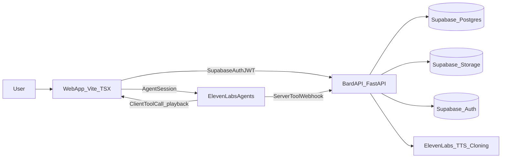
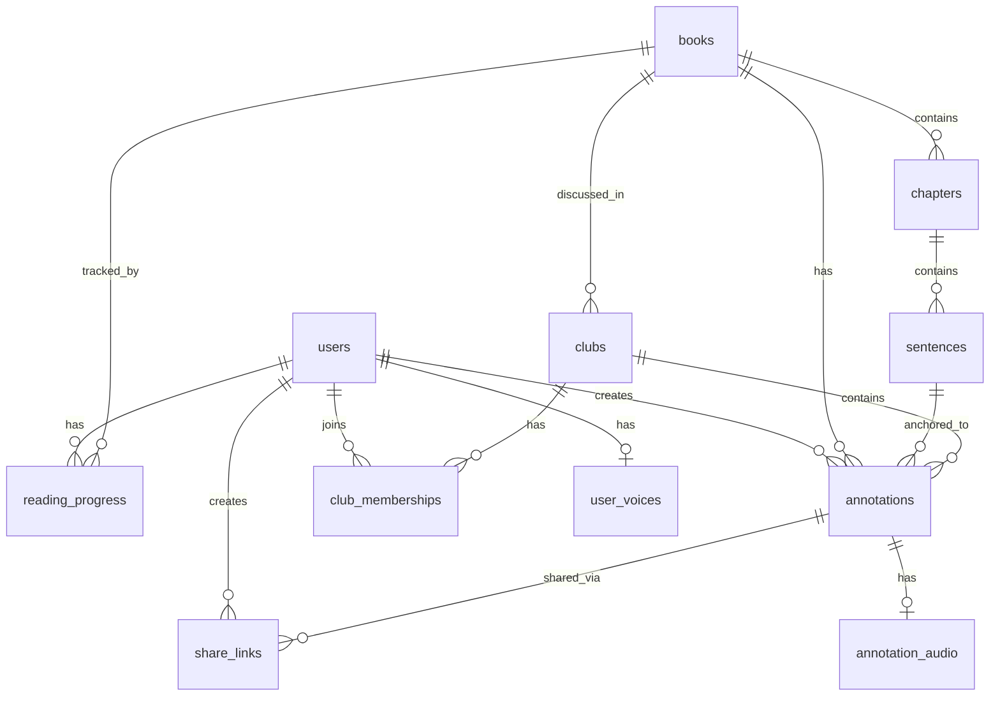
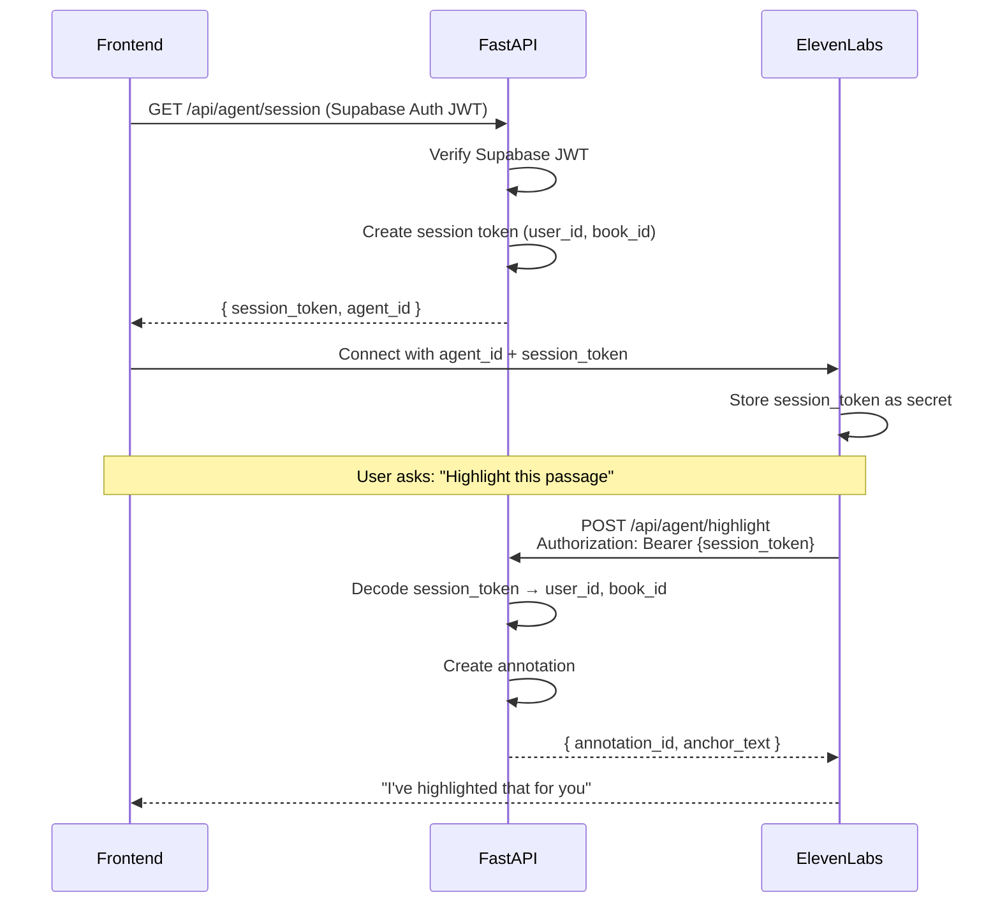
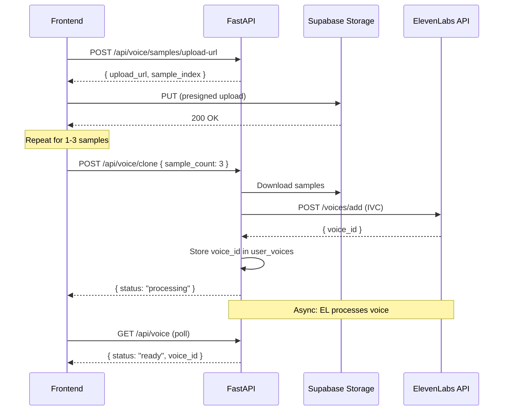

# Bard vNext Plan (Updated: Scrub Progress)

## Decisions locked

- **Primary agent platform**: ElevenLabs Agents.
- **Tools**: Hybrid.
- **Client tools**: playback control (`pause_audiobook`, `resume_audiobook`, optional `seek_to_anchor`).
- **Server webhook tools**: durable actions (notes/highlights/clubs/shares/voice cloning/audio generation).
- **Voice cloning**: under app ElevenLabs account.
- **Public/link sharing**: supported.
- **No proactive actions**: Bard saves/underlines/notes only when user asks.
- **Progress semantics**: **scrubbing/jumping advances progress** (store highest reached anchor).
- **Database**: Supabase Postgres with Row Level Security (RLS).
- **Object Storage**: Supabase Storage with private buckets + signed URLs.
- **Auth**: Supabase Auth (native) → RLS uses `auth.uid()`.
- **Backend language**: Python 3.11+ with strict typing (Pydantic v2, SQLAlchemy 2.0 ORM).

---

## 1) Architecture

### 1.1 System Overview




### 1.2 Backend Project Structure

```javascript
bard-api/
├── pyproject.toml                    # Poetry/PDM project config
├── alembic/                          # Database migrations
│   ├── alembic.ini
│   ├── env.py
│   └── versions/
├── src/
│   └── bard/
│       ├── __init__.py
│       ├── main.py                   # FastAPI app entrypoint
│       ├── config.py                 # Settings via pydantic-settings
│       │
│       ├── core/                     # Cross-cutting concerns
│       │   ├── __init__.py
│       │   ├── auth.py               # Supabase JWT verification
│       │   ├── deps.py               # FastAPI dependencies
│       │   ├── exceptions.py         # Custom exception classes
│       │   └── security.py           # ElevenLabs webhook signature verification
│       │
│       ├── db/                       # Database layer
│       │   ├── __init__.py
│       │   ├── session.py            # AsyncSession factory
│       │   └── models/               # SQLAlchemy ORM models
│       │       ├── __init__.py
│       │       ├── base.py           # DeclarativeBase
│       │       ├── user.py
│       │       ├── book.py
│       │       ├── annotation.py
│       │       ├── club.py
│       │       └── share.py
│       │
│       ├── schemas/                  # Pydantic schemas (API contracts)
│       │   ├── __init__.py
│       │   ├── common.py             # Shared types (Anchor, Pagination, etc.)
│       │   ├── user.py
│       │   ├── book.py
│       │   ├── progress.py
│       │   ├── annotation.py
│       │   ├── club.py
│       │   ├── share.py
│       │   ├── voice.py
│       │   └── agent_tools.py        # ElevenLabs webhook tool schemas
│       │
│       ├── services/                 # Business logic layer
│       │   ├── __init__.py
│       │   ├── user.py
│       │   ├── book.py
│       │   ├── progress.py
│       │   ├── annotation.py
│       │   ├── club.py
│       │   ├── share.py
│       │   ├── voice.py
│       │   ├── storage.py            # Supabase Storage client
│       │   └── elevenlabs.py         # ElevenLabs API client
│       │
│       ├── api/                      # API routes
│       │   ├── __init__.py
│       │   ├── router.py             # Main router aggregation
│       │   └── routes/
│       │       ├── __init__.py
│       │       ├── auth.py           # Auth endpoints (Supabase session handling)
│       │       ├── users.py          # /users/me
│       │       ├── books.py          # /books, /books/{slug}
│       │       ├── progress.py       # /progress
│       │       ├── annotations.py    # /annotations
│       │       ├── clubs.py          # /clubs
│       │       ├── shares.py         # /shares, /s/{token}
│       │       ├── voices.py         # /voices
│       │       └── agent.py          # /agent/tools (ElevenLabs webhooks)
│       │
│       └── workers/                  # Background tasks (optional)
│           ├── __init__.py
│           └── audio_generation.py
│
└── tests/
    ├── conftest.py
    ├── test_auth.py
    ├── test_progress.py
    └── ...
```


### 1.3 Tech Stack

| Layer | Technology | Version ||-------|------------|---------|| Runtime | Python | 3.11+ || Framework | FastAPI | 0.115+ || Validation | Pydantic | 2.x || ORM | SQLAlchemy | 2.0+ || Async DB Driver | asyncpg | 0.29+ || Migrations | Alembic | 1.13+ || Settings | pydantic-settings | 2.x || HTTP Client | httpx | 0.27+ || Auth | PyJWT (HS256 for Supabase JWT) | 2.9+ || Testing | pytest + pytest-asyncio | - |---

## 2) Database Schema (Supabase Postgres)

### 2.1 Entity Relationship Diagram




### 2.2 Core Tables

#### `users`

Created on first auth via Supabase Auth. The `id` matches `auth.uid()` for seamless RLS.

```sql
CREATE TABLE users (
    id UUID PRIMARY KEY REFERENCES auth.users(id) ON DELETE CASCADE,  -- matches auth.uid()
    email TEXT,
    display_name TEXT,
    avatar_url TEXT,
    elevenlabs_voice_id TEXT,                -- cloned voice ID (nullable)
    created_at TIMESTAMPTZ DEFAULT now(),
    updated_at TIMESTAMPTZ DEFAULT now()
);
```


#### `books`

Audiobook catalog. For v1, single book; schema supports multi-book.

```sql
CREATE TABLE books (
    id UUID PRIMARY KEY DEFAULT gen_random_uuid(),
    slug TEXT UNIQUE NOT NULL,               -- URL-friendly identifier
    title TEXT NOT NULL,
    author TEXT,
    cover_url TEXT,
    total_chapters INT DEFAULT 0,
    total_sentences INT DEFAULT 0,
    is_published BOOLEAN DEFAULT false,
    created_at TIMESTAMPTZ DEFAULT now(),
    updated_at TIMESTAMPTZ DEFAULT now()
);

CREATE INDEX idx_books_slug ON books(slug);
```


#### `chapters`

Chapter metadata with audio references.

```sql
CREATE TABLE chapters (
    id UUID PRIMARY KEY DEFAULT gen_random_uuid(),
    book_id UUID NOT NULL REFERENCES books(id) ON DELETE CASCADE,
    chapter_number INT NOT NULL,             -- 1-indexed display order
    title TEXT NOT NULL,
    audio_path TEXT,                         -- storage path: audiobook-audio/{book_slug}/chapter_{n}.mp3
    duration_seconds NUMERIC(10,3),
    sentence_count INT DEFAULT 0,
    created_at TIMESTAMPTZ DEFAULT now(),
    
    UNIQUE(book_id, chapter_number)
);

CREATE INDEX idx_chapters_book ON chapters(book_id, chapter_number);
```


#### `sentences`

Sentence-level text + alignment for RAG context and playback sync.

```sql
CREATE TABLE sentences (
    id UUID PRIMARY KEY DEFAULT gen_random_uuid(),
    chapter_id UUID NOT NULL REFERENCES chapters(id) ON DELETE CASCADE,
    sequence INT NOT NULL,                   -- 0-indexed order within chapter
    global_sequence INT NOT NULL,            -- global order across entire book (for progress)
    text TEXT NOT NULL,
    start_time NUMERIC(10,3),                -- seconds from chapter audio start
    end_time NUMERIC(10,3),
    
    UNIQUE(chapter_id, sequence)
);

CREATE INDEX idx_sentences_chapter_seq ON sentences(chapter_id, sequence);
CREATE INDEX idx_sentences_chapter_time ON sentences(chapter_id, start_time);
CREATE INDEX idx_sentences_global ON sentences(global_sequence);
```


#### `reading_progress`

User progress per book. `max_sentence_global_seq` is the canonical progress marker.

```sql
CREATE TABLE reading_progress (
    id UUID PRIMARY KEY DEFAULT gen_random_uuid(),
    user_id UUID NOT NULL REFERENCES users(id) ON DELETE CASCADE,
    book_id UUID NOT NULL REFERENCES books(id) ON DELETE CASCADE,
    
    -- Current playback position (for resume)
    current_chapter_id UUID REFERENCES chapters(id),
    current_audio_time NUMERIC(10,3) DEFAULT 0,
    
    -- Progress watermark (max reached, monotonic)
    max_sentence_global_seq INT DEFAULT 0,
    
    -- Timestamps
    started_at TIMESTAMPTZ DEFAULT now(),
    last_played_at TIMESTAMPTZ DEFAULT now(),
    completed_at TIMESTAMPTZ,                -- set when max_sentence = total_sentences
    
    UNIQUE(user_id, book_id)
);

CREATE INDEX idx_progress_user ON reading_progress(user_id);
CREATE INDEX idx_progress_book ON reading_progress(book_id);
```


#### `annotations`

Unified table for highlights and notes. Uses `type` discriminator.

```sql
CREATE TYPE annotation_type AS ENUM ('highlight', 'note');
CREATE TYPE annotation_visibility AS ENUM ('private', 'club', 'public');

CREATE TABLE annotations (
    id UUID PRIMARY KEY DEFAULT gen_random_uuid(),
    user_id UUID NOT NULL REFERENCES users(id) ON DELETE CASCADE,
    book_id UUID NOT NULL REFERENCES books(id) ON DELETE CASCADE,
    
    -- Anchor (sentence range)
    start_sentence_id UUID NOT NULL REFERENCES sentences(id),
    end_sentence_id UUID NOT NULL REFERENCES sentences(id),
    start_global_seq INT NOT NULL,           -- denormalized for spoiler gating
    end_global_seq INT NOT NULL,
    
    -- Content
    type annotation_type NOT NULL,
    text TEXT,                               -- note text or highlight comment
    
    -- Visibility
    visibility annotation_visibility DEFAULT 'private',
    club_id UUID REFERENCES clubs(id) ON DELETE SET NULL,
    
    -- Metadata
    created_at TIMESTAMPTZ DEFAULT now(),
    updated_at TIMESTAMPTZ DEFAULT now()
);

CREATE INDEX idx_annotations_user ON annotations(user_id);
CREATE INDEX idx_annotations_book ON annotations(book_id);
CREATE INDEX idx_annotations_club ON annotations(club_id) WHERE club_id IS NOT NULL;
CREATE INDEX idx_annotations_end_seq ON annotations(end_global_seq);
CREATE INDEX idx_annotations_visibility ON annotations(visibility);
```


#### `annotation_audio`

Voiced notes (lazy-generated, cached).

```sql
CREATE TYPE audio_status AS ENUM ('pending', 'generating', 'ready', 'failed');

CREATE TABLE annotation_audio (
    id UUID PRIMARY KEY DEFAULT gen_random_uuid(),
    annotation_id UUID UNIQUE NOT NULL REFERENCES annotations(id) ON DELETE CASCADE,
    
    status audio_status DEFAULT 'pending',
    audio_path TEXT,                         -- storage path when ready
    duration_seconds NUMERIC(10,3),
    voice_id TEXT,                           -- ElevenLabs voice used
    
    created_at TIMESTAMPTZ DEFAULT now(),
    generated_at TIMESTAMPTZ
);

CREATE INDEX idx_annotation_audio_status ON annotation_audio(status);
```


#### `clubs`

Reading clubs for shared annotations.

```sql
CREATE TABLE clubs (
    id UUID PRIMARY KEY DEFAULT gen_random_uuid(),
    book_id UUID NOT NULL REFERENCES books(id) ON DELETE CASCADE,
    
    name TEXT NOT NULL,
    description TEXT,
    slug TEXT UNIQUE NOT NULL,               -- invite code / URL slug
    owner_id UUID NOT NULL REFERENCES users(id),
    
    is_public BOOLEAN DEFAULT false,         -- discoverable vs invite-only
    max_members INT DEFAULT 50,
    
    created_at TIMESTAMPTZ DEFAULT now(),
    updated_at TIMESTAMPTZ DEFAULT now()
);

CREATE INDEX idx_clubs_book ON clubs(book_id);
CREATE INDEX idx_clubs_owner ON clubs(owner_id);
CREATE INDEX idx_clubs_slug ON clubs(slug);
```


#### `club_memberships`

```sql
CREATE TYPE membership_role AS ENUM ('member', 'moderator', 'owner');

CREATE TABLE club_memberships (
    id UUID PRIMARY KEY DEFAULT gen_random_uuid(),
    club_id UUID NOT NULL REFERENCES clubs(id) ON DELETE CASCADE,
    user_id UUID NOT NULL REFERENCES users(id) ON DELETE CASCADE,
    
    role membership_role DEFAULT 'member',
    joined_at TIMESTAMPTZ DEFAULT now(),
    
    UNIQUE(club_id, user_id)
);

CREATE INDEX idx_memberships_user ON club_memberships(user_id);
CREATE INDEX idx_memberships_club ON club_memberships(club_id);
```


#### `share_links`

Public/link sharing with optional expiry.

```sql
CREATE TYPE share_target_type AS ENUM ('annotation', 'club', 'progress');

CREATE TABLE share_links (
    id UUID PRIMARY KEY DEFAULT gen_random_uuid(),
    user_id UUID NOT NULL REFERENCES users(id) ON DELETE CASCADE,
    
    token TEXT UNIQUE NOT NULL,              -- short unique token for URL
    target_type share_target_type NOT NULL,
    target_id UUID NOT NULL,                 -- polymorphic FK
    
    expires_at TIMESTAMPTZ,                  -- NULL = never expires
    view_count INT DEFAULT 0,
    max_views INT,                           -- NULL = unlimited
    
    created_at TIMESTAMPTZ DEFAULT now()
);

CREATE INDEX idx_share_links_token ON share_links(token);
CREATE INDEX idx_share_links_user ON share_links(user_id);
```


#### `user_voices`

Voice cloning metadata.

```sql
CREATE TYPE voice_status AS ENUM ('pending', 'processing', 'ready', 'failed');

CREATE TABLE user_voices (
    id UUID PRIMARY KEY DEFAULT gen_random_uuid(),
    user_id UUID UNIQUE NOT NULL REFERENCES users(id) ON DELETE CASCADE,
    
    elevenlabs_voice_id TEXT,
    status voice_status DEFAULT 'pending',
    sample_count INT DEFAULT 0,
    
    created_at TIMESTAMPTZ DEFAULT now(),
    updated_at TIMESTAMPTZ DEFAULT now()
);
```


### 2.3 Row Level Security (RLS) Policies

All tables have RLS enabled. Policies use `auth.uid()` from Supabase Auth.

```sql
-- USERS: users can read/update own profile
ALTER TABLE users ENABLE ROW LEVEL SECURITY;

CREATE POLICY "Users can view own profile"
  ON users FOR SELECT
  USING (id = auth.uid());

CREATE POLICY "Users can update own profile"
  ON users FOR UPDATE
  USING (id = auth.uid());

CREATE POLICY "Users can insert own profile"
  ON users FOR INSERT
  WITH CHECK (id = auth.uid());

-- BOOKS: all authenticated users can read published books
ALTER TABLE books ENABLE ROW LEVEL SECURITY;

CREATE POLICY "Anyone can read published books"
  ON books FOR SELECT
  TO authenticated
  USING (is_published = true);

-- CHAPTERS/SENTENCES: inherit from book visibility
ALTER TABLE chapters ENABLE ROW LEVEL SECURITY;
ALTER TABLE sentences ENABLE ROW LEVEL SECURITY;

CREATE POLICY "Read chapters of published books"
  ON chapters FOR SELECT
  TO authenticated
  USING (book_id IN (SELECT id FROM books WHERE is_published = true));

CREATE POLICY "Read sentences of published books"
  ON sentences FOR SELECT
  TO authenticated
  USING (chapter_id IN (
    SELECT c.id FROM chapters c 
    JOIN books b ON c.book_id = b.id 
    WHERE b.is_published = true
  ));

-- READING_PROGRESS: users own their progress
ALTER TABLE reading_progress ENABLE ROW LEVEL SECURITY;

CREATE POLICY "Users manage own progress"
  ON reading_progress FOR ALL
  TO authenticated
  USING (user_id = auth.uid())
  WITH CHECK (user_id = auth.uid());

-- ANNOTATIONS: complex visibility rules
ALTER TABLE annotations ENABLE ROW LEVEL SECURITY;

-- Users can always manage their own annotations
CREATE POLICY "Users manage own annotations"
  ON annotations FOR ALL
  TO authenticated
  USING (user_id = auth.uid())
  WITH CHECK (user_id = auth.uid());

-- Users can view club annotations if member AND not spoiler
CREATE POLICY "Club members view club annotations"
  ON annotations AS a FOR SELECT
  TO authenticated
  USING (
    a.visibility = 'club' 
    AND a.club_id IN (SELECT cm.club_id FROM club_memberships cm WHERE cm.user_id = auth.uid())
    AND a.end_global_seq <= (
      SELECT COALESCE(rp.max_sentence_global_seq, 0) 
      FROM reading_progress rp 
      WHERE rp.user_id = auth.uid() AND rp.book_id = a.book_id
    )
  );

-- Users can view public annotations if not spoiler
CREATE POLICY "View public annotations (spoiler-gated)"
  ON annotations AS a FOR SELECT
  TO authenticated
  USING (
    a.visibility = 'public'
    AND a.end_global_seq <= (
      SELECT COALESCE(rp.max_sentence_global_seq, 0) 
      FROM reading_progress rp 
      WHERE rp.user_id = auth.uid() AND rp.book_id = a.book_id
    )
  );

-- CLUBS: readable by members or if public
ALTER TABLE clubs ENABLE ROW LEVEL SECURITY;

CREATE POLICY "View clubs user is member of"
  ON clubs FOR SELECT
  TO authenticated
  USING (
    is_public = true 
    OR id IN (SELECT club_id FROM club_memberships WHERE user_id = auth.uid())
  );

CREATE POLICY "Owners can update clubs"
  ON clubs FOR UPDATE
  TO authenticated
  USING (owner_id = auth.uid());

-- CLUB_MEMBERSHIPS
ALTER TABLE club_memberships ENABLE ROW LEVEL SECURITY;

CREATE POLICY "View own memberships"
  ON club_memberships FOR SELECT
  TO authenticated
  USING (user_id = auth.uid());

-- Allow users to join public clubs or clubs they have invite link for
CREATE POLICY "Users can join clubs"
  ON club_memberships FOR INSERT
  TO authenticated
  WITH CHECK (
    user_id = auth.uid()
    AND (
      -- Can join public clubs
      club_id IN (SELECT id FROM clubs WHERE is_public = true)
      -- Or any club (invite link validation handled at API layer)
      OR true
    )
  );

-- Allow users to leave clubs (delete own membership)
CREATE POLICY "Users can leave clubs"
  ON club_memberships FOR DELETE
  TO authenticated
  USING (user_id = auth.uid());

CREATE POLICY "Club owners/mods manage memberships"
  ON club_memberships FOR ALL
  TO authenticated
  USING (
    club_id IN (
      SELECT club_id FROM club_memberships 
      WHERE user_id = auth.uid() AND role IN ('owner', 'moderator')
    )
  );

-- SHARE_LINKS: users manage own links
ALTER TABLE share_links ENABLE ROW LEVEL SECURITY;

CREATE POLICY "Users manage own share links"
  ON share_links FOR ALL
  TO authenticated
  USING (user_id = auth.uid())
  WITH CHECK (user_id = auth.uid());

-- Public read for valid tokens (used by anon for shared links)
CREATE POLICY "Anyone can read valid share links by token"
  ON share_links FOR SELECT
  TO anon
  USING (
    (expires_at IS NULL OR expires_at > now())
    AND (max_views IS NULL OR view_count < max_views)
  );
```

---

## 3) Object Storage (Supabase Storage)

### 3.1 Bucket Structure

| Bucket | Access | Purpose ||--------|--------|---------|| `audiobook-audio` | Private | Chapter MP3 files, served via signed URLs || `annotation-audio` | Private | Voiced notes, served via signed URLs || `voice-samples` | Private | User voice samples for cloning || `avatars` | Public | User profile images || `book-covers` | Public | Book cover images |

### 3.2 Storage Path Conventions

```javascript
audiobook-audio/
  └── {book_slug}/
      └── chapter_{chapter_number}.mp3

annotation-audio/
  └── {user_id}/
      └── {annotation_id}.mp3

voice-samples/
  └── {user_id}/
      └── sample_{index}.webm

avatars/
  └── {user_id}.jpg

book-covers/
  └── {book_slug}.jpg
```


### 3.3 Storage RLS Policies

```sql
-- AUDIOBOOK-AUDIO: authenticated users can read (via signed URLs from API)
CREATE POLICY "Authenticated users download audiobook audio"
  ON storage.objects FOR SELECT
  TO authenticated
  USING (bucket_id = 'audiobook-audio');

-- ANNOTATION-AUDIO: users can read own, API handles other access
CREATE POLICY "Users read own annotation audio"
  ON storage.objects FOR SELECT
  TO authenticated
  USING (
    bucket_id = 'annotation-audio' 
    AND (storage.foldername(name))[1] = auth.uid()::text
  );

-- VOICE-SAMPLES: users can upload to own folder only
CREATE POLICY "Users upload voice samples to own folder"
  ON storage.objects FOR INSERT
  TO authenticated
  WITH CHECK (
    bucket_id = 'voice-samples'
    AND (storage.foldername(name))[1] = auth.uid()::text
  );

CREATE POLICY "Users read own voice samples"
  ON storage.objects FOR SELECT
  TO authenticated
  USING (
    bucket_id = 'voice-samples'
    AND (storage.foldername(name))[1] = auth.uid()::text
  );

-- AVATARS: public read, users upload own
CREATE POLICY "Public avatar read"
  ON storage.objects FOR SELECT
  TO public
  USING (bucket_id = 'avatars');

CREATE POLICY "Users upload own avatar"
  ON storage.objects FOR INSERT
  TO authenticated
  WITH CHECK (
    bucket_id = 'avatars'
    AND name = auth.uid()::text || '.jpg'
  );

-- BOOK-COVERS: public read only
CREATE POLICY "Public book cover read"
  ON storage.objects FOR SELECT
  TO public
  USING (bucket_id = 'book-covers');
```


### 3.4 Signed URL Strategy

- **Audiobook audio**: API generates short-lived signed URLs (1 hour) for chapter playback
- **Annotation audio**: API validates access (ownership OR spoiler-gated visibility) then returns signed URL
- **Voice samples**: Direct upload from client to user's folder; API orchestrates cloning job

---

## 4) Backend: Pydantic Schemas (API Contracts)

All API request/response bodies are strongly typed with Pydantic v2. These schemas serve as the contract between frontend and backend.

### 4.1 Common Types (`schemas/common.py`)

```python
from datetime import datetime
from typing import Generic, TypeVar
from uuid import UUID

from pydantic import BaseModel, ConfigDict, Field

T = TypeVar("T")


class CamelModel(BaseModel):
    """Base model with camelCase serialization for frontend."""
    model_config = ConfigDict(
        populate_by_name=True,
        alias_generator=lambda s: "".join(
            w.capitalize() if i else w for i, w in enumerate(s.split("_"))
        ),
    )


class Anchor(CamelModel):
    """Sentence anchor for annotations and context."""
    sentence_id: UUID
    global_seq: int = Field(..., description="Global sequence number across book")
    chapter_id: UUID
    chapter_number: int
    text: str


class AnchorRange(CamelModel):
    """Range of sentences for multi-sentence annotations."""
    start: Anchor
    end: Anchor


class PaginationParams(CamelModel):
    """Standard pagination parameters."""
    limit: int = Field(default=20, ge=1, le=100)
    offset: int = Field(default=0, ge=0)


class PaginatedResponse(CamelModel, Generic[T]):
    """Paginated response wrapper."""
    items: list[T]
    total: int
    limit: int
    offset: int
    has_more: bool


class TimestampMixin(CamelModel):
    """Mixin for created/updated timestamps."""
    created_at: datetime
    updated_at: datetime | None = None
```


### 4.2 User Schemas (`schemas/user.py`)

```python
from uuid import UUID
from pydantic import EmailStr, Field, HttpUrl

from .common import CamelModel, TimestampMixin


class UserBase(CamelModel):
    email: EmailStr | None = None
    display_name: str | None = None
    avatar_url: HttpUrl | None = None


class UserCreate(UserBase):
    """Internal: created on first auth via Supabase."""
    id: UUID  # matches auth.uid()


class UserUpdate(CamelModel):
    """User profile updates."""
    display_name: str | None = Field(None, min_length=1, max_length=100)
    avatar_url: HttpUrl | None = None


class UserPublic(UserBase, TimestampMixin):
    """Public user representation."""
    id: UUID
    has_voice: bool = Field(
        default=False, 
        description="Whether user has cloned voice"
    )


class UserMe(UserPublic):
    """Current user with private fields."""
    elevenlabs_voice_id: str | None = None
```


### 4.3 Book Schemas (`schemas/book.py`)

```python
from decimal import Decimal
from uuid import UUID
from pydantic import Field, HttpUrl

from .common import CamelModel, TimestampMixin


class SentenceOut(CamelModel):
    """Sentence with alignment data."""
    id: UUID
    sequence: int = Field(..., description="0-indexed within chapter")
    global_sequence: int = Field(..., description="Global order in book")
    text: str
    start_time: Decimal = Field(..., description="Seconds from chapter start")
    end_time: Decimal


class ChapterOut(CamelModel, TimestampMixin):
    """Chapter metadata."""
    id: UUID
    chapter_number: int
    title: str
    duration_seconds: Decimal | None
    sentence_count: int


class ChapterDetail(ChapterOut):
    """Chapter with sentences and audio URL."""
    sentences: list[SentenceOut]
    audio_url: str = Field(..., description="Signed URL, valid ~1 hour")


class BookSummary(CamelModel, TimestampMixin):
    """Book list item."""
    id: UUID
    slug: str
    title: str
    author: str | None
    cover_url: HttpUrl | None
    total_chapters: int
    total_sentences: int


class BookDetail(BookSummary):
    """Book with chapters."""
    chapters: list[ChapterOut]
```


### 4.4 Progress Schemas (`schemas/progress.py`)

```python
from datetime import datetime
from decimal import Decimal
from uuid import UUID
from pydantic import Field

from .common import CamelModel


class ProgressUpdate(CamelModel):
    """Client sends this on playback/seek."""
    book_id: UUID
    chapter_id: UUID
    audio_time: Decimal = Field(..., ge=0, description="Current playback time")
    candidate_max_global_seq: int = Field(
        ..., 
        ge=0, 
        description="Sentence global_sequence at current position"
    )


class ProgressOut(CamelModel):
    """User's progress for a book."""
    id: UUID
    book_id: UUID
    current_chapter_id: UUID | None
    current_audio_time: Decimal
    max_sentence_global_seq: int = Field(
        ..., 
        description="Furthest sentence reached (spoiler watermark)"
    )
    started_at: datetime
    last_played_at: datetime
    completed_at: datetime | None
    completion_percent: float = Field(
        ..., 
        ge=0, 
        le=100, 
        description="Calculated from max_sentence_global_seq / total_sentences"
    )
```


### 4.5 Annotation Schemas (`schemas/annotation.py`)

```python
from datetime import datetime
from enum import StrEnum
from uuid import UUID
from pydantic import Field

from .common import CamelModel, AnchorRange, PaginatedResponse


class AnnotationType(StrEnum):
    HIGHLIGHT = "highlight"
    NOTE = "note"


class AnnotationVisibility(StrEnum):
    PRIVATE = "private"
    CLUB = "club"
    PUBLIC = "public"


class AudioStatus(StrEnum):
    PENDING = "pending"
    GENERATING = "generating"
    READY = "ready"
    FAILED = "failed"


class AnnotationCreate(CamelModel):
    """Create annotation request."""
    book_id: UUID
    start_sentence_id: UUID
    end_sentence_id: UUID
    type: AnnotationType
    text: str | None = None
    visibility: AnnotationVisibility = AnnotationVisibility.PRIVATE
    club_id: UUID | None = None


class AnnotationUpdate(CamelModel):
    """Update annotation request."""
    text: str | None = None
    visibility: AnnotationVisibility | None = None
    club_id: UUID | None = None


class AnnotationAudioOut(CamelModel):
    """Voiced note audio status."""
    status: AudioStatus
    audio_url: str | None = Field(
        None, 
        description="Signed URL when status=ready"
    )
    duration_seconds: float | None


class AnnotationOut(CamelModel):
    """Annotation response."""
    id: UUID
    user_id: UUID
    book_id: UUID
    anchor: AnchorRange
    type: AnnotationType
    text: str | None
    visibility: AnnotationVisibility
    club_id: UUID | None
    audio: AnnotationAudioOut | None
    created_at: datetime
    updated_at: datetime | None
    
    # Enrichments
    author_name: str | None = Field(
        None, 
        description="Display name of annotation creator"
    )
    is_mine: bool = Field(
        ..., 
        description="Whether current user owns this annotation"
    )


class AnnotationListResponse(PaginatedResponse[AnnotationOut]):
    """Paginated annotations."""
    pass


class AnnotationSearchParams(CamelModel):
    """Search/filter annotations."""
    book_id: UUID | None = None
    chapter_id: UUID | None = None
    type: AnnotationType | None = None
    visibility: AnnotationVisibility | None = None
    club_id: UUID | None = None
    query: str | None = Field(None, min_length=2, max_length=200)
    near_global_seq: int | None = Field(
        None, 
        description="Filter to annotations near this position"
    )
    range_sentences: int = Field(
        default=50, 
        ge=1, 
        le=500,
        description="Sentence range for near_global_seq filter"
    )
    # Pagination
    limit: int = Field(default=20, ge=1, le=100)
    offset: int = Field(default=0, ge=0)
```


### 4.6 Club Schemas (`schemas/club.py`)

```python
from datetime import datetime
from enum import StrEnum
from uuid import UUID
from pydantic import Field

from .common import CamelModel, PaginatedResponse


class MembershipRole(StrEnum):
    MEMBER = "member"
    MODERATOR = "moderator"
    OWNER = "owner"


class ClubCreate(CamelModel):
    """Create a reading club."""
    book_id: UUID
    name: str = Field(..., min_length=3, max_length=100)
    description: str | None = Field(None, max_length=1000)
    is_public: bool = False
    max_members: int = Field(default=50, ge=2, le=500)


class ClubUpdate(CamelModel):
    """Update club settings."""
    name: str | None = Field(None, min_length=3, max_length=100)
    description: str | None = Field(None, max_length=1000)
    is_public: bool | None = None
    max_members: int | None = Field(None, ge=2, le=500)


class ClubMemberOut(CamelModel):
    """Club member info."""
    user_id: UUID
    display_name: str | None
    avatar_url: str | None
    role: MembershipRole
    joined_at: datetime


class ClubOut(CamelModel):
    """Club response."""
    id: UUID
    book_id: UUID
    name: str
    description: str | None
    slug: str = Field(..., description="Invite code / URL slug")
    owner_id: UUID
    is_public: bool
    max_members: int
    member_count: int
    my_role: MembershipRole | None = Field(
        None, 
        description="Current user's role, None if not member"
    )
    created_at: datetime


class ClubDetail(ClubOut):
    """Club with members."""
    members: list[ClubMemberOut]


class ClubListResponse(PaginatedResponse[ClubOut]):
    """Paginated clubs."""
    pass
```


### 4.7 Share Schemas (`schemas/share.py`)

```python
from datetime import datetime
from enum import StrEnum
from uuid import UUID
from pydantic import Field

from .common import CamelModel


class ShareTargetType(StrEnum):
    ANNOTATION = "annotation"
    CLUB = "club"
    PROGRESS = "progress"


class ShareLinkCreate(CamelModel):
    """Create a share link."""
    target_type: ShareTargetType
    target_id: UUID
    expires_in_hours: int | None = Field(
        None, 
        ge=1, 
        le=8760,  # 1 year max
        description="Hours until expiry, None = never"
    )
    max_views: int | None = Field(
        None, 
        ge=1, 
        le=10000,
        description="Max view count, None = unlimited"
    )


class ShareLinkOut(CamelModel):
    """Share link response."""
    id: UUID
    token: str
    url: str = Field(..., description="Full shareable URL")
    target_type: ShareTargetType
    target_id: UUID
    expires_at: datetime | None
    max_views: int | None
    view_count: int
    created_at: datetime


class SharedContentOut(CamelModel):
    """Content accessed via share link (public endpoint)."""
    target_type: ShareTargetType
    content: dict  # Polymorphic based on target_type
    sharer_name: str | None
    created_at: datetime
```


### 4.8 Voice Schemas (`schemas/voice.py`)

```python
from datetime import datetime
from enum import StrEnum
from uuid import UUID
from pydantic import Field

from .common import CamelModel


class VoiceStatus(StrEnum):
    PENDING = "pending"
    PROCESSING = "processing"
    READY = "ready"
    FAILED = "failed"


class VoiceOut(CamelModel):
    """User's cloned voice status."""
    id: UUID
    status: VoiceStatus
    sample_count: int
    elevenlabs_voice_id: str | None = Field(
        None, 
        description="Only present when status=ready"
    )
    created_at: datetime
    updated_at: datetime


class VoiceSampleUploadRequest(CamelModel):
    """Request upload URL for voice sample."""
    filename: str = Field(..., pattern=r"^[\w\-]+\.(webm|mp3|wav|m4a)$")


class VoiceSampleUploadResponse(CamelModel):
    """Response with presigned upload URL."""
    upload_url: str
    sample_index: int


class VoiceCloneRequest(CamelModel):
    """Trigger voice cloning after samples uploaded."""
    sample_count: int = Field(..., ge=1, le=25)
```


### 4.9 Agent Tool Schemas (`schemas/agent_tools.py`)

These schemas define the ElevenLabs server webhook tool payloads.

```python
from uuid import UUID
from pydantic import Field

from .common import CamelModel
from .annotation import AnnotationType, AnnotationVisibility, AnnotationOut


# === Tool Request Schemas (from ElevenLabs) ===

class AgentToolContext(CamelModel):
    """Context passed with every agent tool call."""
    user_id: UUID = Field(..., description="Internal user ID from session")
    book_id: UUID
    current_chapter_id: UUID
    current_global_seq: int = Field(
        ..., 
        description="User's current playback position"
    )


class CreateHighlightParams(CamelModel):
    """Parameters for create_highlight tool."""
    context: AgentToolContext
    start_global_seq: int
    end_global_seq: int
    visibility: AnnotationVisibility = AnnotationVisibility.PRIVATE
    club_id: UUID | None = None
    comment: str | None = None


class CreateNoteParams(CamelModel):
    """Parameters for create_note tool."""
    context: AgentToolContext
    start_global_seq: int
    end_global_seq: int
    text: str = Field(..., min_length=1)
    visibility: AnnotationVisibility = AnnotationVisibility.PRIVATE
    club_id: UUID | None = None


class ListAnnotationsHereParams(CamelModel):
    """Parameters for list_annotations_here tool."""
    context: AgentToolContext
    scope: AnnotationVisibility | None = None  # None = all visible
    range_sentences: int = Field(default=20, ge=1, le=100)
    limit: int = Field(default=10, ge=1, le=50)


class SearchAnnotationsParams(CamelModel):
    """Parameters for search_annotations tool."""
    context: AgentToolContext
    query: str = Field(..., min_length=2, max_length=200)
    scope: AnnotationVisibility | None = None
    limit: int = Field(default=10, ge=1, le=50)


class CreateShareLinkParams(CamelModel):
    """Parameters for create_share_link tool."""
    context: AgentToolContext
    target_type: str  # "annotation" | "club" | "progress"
    target_id: UUID


class GetAnnotationAudioParams(CamelModel):
    """Parameters for get_annotation_audio tool."""
    context: AgentToolContext
    annotation_id: UUID


# === Tool Response Schemas (to ElevenLabs) ===

class ToolSuccess(CamelModel):
    """Generic success response."""
    success: bool = True
    message: str | None = None


class CreateAnnotationResponse(ToolSuccess):
    """Response for create_highlight/create_note."""
    annotation_id: UUID
    anchor_text: str = Field(
        ..., 
        description="Quoted text for agent to confirm"
    )


class ListAnnotationsResponse(ToolSuccess):
    """Response for list_annotations_here."""
    annotations: list[AnnotationOut]
    count: int


class SearchAnnotationsResponse(ToolSuccess):
    """Response for search_annotations."""
    annotations: list[AnnotationOut]
    count: int


class CreateShareLinkResponse(ToolSuccess):
    """Response for create_share_link."""
    url: str
    expires_at: str | None


class GetAnnotationAudioResponse(ToolSuccess):
    """Response for get_annotation_audio."""
    status: str  # "pending" | "generating" | "ready" | "failed"
    audio_url: str | None = Field(
        None, 
        description="Signed URL when ready"
    )
    message: str | None = Field(
        None, 
        description="Status message for agent to relay"
    )


class ToolError(CamelModel):
    """Error response for any tool."""
    success: bool = False
    error: str
    code: str | None = Field(
        None, 
        description="Machine-readable error code"
    )
```

---

## 5) Backend: SQLAlchemy ORM Models

Strongly-typed SQLAlchemy 2.0 models with `Mapped` type hints.

### 5.1 Base Model (`db/models/base.py`)

```python
from datetime import datetime
from uuid import UUID, uuid4

from sqlalchemy import DateTime, func
from sqlalchemy.dialects.postgresql import UUID as PG_UUID
from sqlalchemy.orm import DeclarativeBase, Mapped, mapped_column


class Base(DeclarativeBase):
    """Base class for all ORM models."""
    pass


class TimestampMixin:
    """Mixin for created_at/updated_at columns."""
    created_at: Mapped[datetime] = mapped_column(
        DateTime(timezone=True),
        server_default=func.now(),
        nullable=False,
    )
    updated_at: Mapped[datetime | None] = mapped_column(
        DateTime(timezone=True),
        onupdate=func.now(),
        nullable=True,
    )


class UUIDMixin:
    """Mixin for UUID primary key."""
    id: Mapped[UUID] = mapped_column(
        PG_UUID(as_uuid=True),
        primary_key=True,
        default=uuid4,
    )
```


### 5.2 User Model (`db/models/user.py`)

```python
from uuid import UUID
from typing import TYPE_CHECKING

from sqlalchemy import String, Text
from sqlalchemy.orm import Mapped, mapped_column, relationship

from .base import Base, TimestampMixin, UUIDMixin

if TYPE_CHECKING:
    from .annotation import Annotation
    from .progress import ReadingProgress
    from .club import ClubMembership
    from .voice import UserVoice


class User(Base, UUIDMixin, TimestampMixin):
    __tablename__ = "users"

    # id is inherited from UUIDMixin, matches auth.uid() from Supabase Auth
    email: Mapped[str | None] = mapped_column(String(255))
    display_name: Mapped[str | None] = mapped_column(String(100))
    avatar_url: Mapped[str | None] = mapped_column(Text)
    elevenlabs_voice_id: Mapped[str | None] = mapped_column(String(255))

    # Relationships
    annotations: Mapped[list["Annotation"]] = relationship(
        back_populates="user", cascade="all, delete-orphan"
    )
    reading_progress: Mapped[list["ReadingProgress"]] = relationship(
        back_populates="user", cascade="all, delete-orphan"
    )
    club_memberships: Mapped[list["ClubMembership"]] = relationship(
        back_populates="user", cascade="all, delete-orphan"
    )
    voice: Mapped["UserVoice | None"] = relationship(
        back_populates="user", uselist=False, cascade="all, delete-orphan"
    )
```


### 5.3 Book Models (`db/models/book.py`)

```python
from decimal import Decimal
from uuid import UUID
from typing import TYPE_CHECKING

from sqlalchemy import Boolean, ForeignKey, Integer, Numeric, String, Text, UniqueConstraint
from sqlalchemy.orm import Mapped, mapped_column, relationship

from .base import Base, TimestampMixin, UUIDMixin

if TYPE_CHECKING:
    from .annotation import Annotation
    from .progress import ReadingProgress


class Book(Base, UUIDMixin, TimestampMixin):
    __tablename__ = "books"

    slug: Mapped[str] = mapped_column(
        String(100), unique=True, nullable=False, index=True
    )
    title: Mapped[str] = mapped_column(String(255), nullable=False)
    author: Mapped[str | None] = mapped_column(String(255))
    cover_url: Mapped[str | None] = mapped_column(Text)
    total_chapters: Mapped[int] = mapped_column(Integer, default=0)
    total_sentences: Mapped[int] = mapped_column(Integer, default=0)
    is_published: Mapped[bool] = mapped_column(Boolean, default=False)

    # Relationships
    chapters: Mapped[list["Chapter"]] = relationship(
        back_populates="book",
        cascade="all, delete-orphan",
        order_by="Chapter.chapter_number",
    )
    annotations: Mapped[list["Annotation"]] = relationship(back_populates="book")
    reading_progress: Mapped[list["ReadingProgress"]] = relationship(
        back_populates="book"
    )


class Chapter(Base, UUIDMixin, TimestampMixin):
    __tablename__ = "chapters"
    __table_args__ = (
        UniqueConstraint("book_id", "chapter_number", name="uq_chapter_book_number"),
    )

    book_id: Mapped[UUID] = mapped_column(
        ForeignKey("books.id", ondelete="CASCADE"), nullable=False, index=True
    )
    chapter_number: Mapped[int] = mapped_column(Integer, nullable=False)
    title: Mapped[str] = mapped_column(String(255), nullable=False)
    audio_path: Mapped[str | None] = mapped_column(Text)
    duration_seconds: Mapped[Decimal | None] = mapped_column(Numeric(10, 3))
    sentence_count: Mapped[int] = mapped_column(Integer, default=0)

    # Relationships
    book: Mapped["Book"] = relationship(back_populates="chapters")
    sentences: Mapped[list["Sentence"]] = relationship(
        back_populates="chapter",
        cascade="all, delete-orphan",
        order_by="Sentence.sequence",
    )


class Sentence(Base, UUIDMixin):
    __tablename__ = "sentences"

    chapter_id: Mapped[UUID] = mapped_column(
        ForeignKey("chapters.id", ondelete="CASCADE"), nullable=False, index=True
    )
    sequence: Mapped[int] = mapped_column(Integer, nullable=False)
    global_sequence: Mapped[int] = mapped_column(Integer, nullable=False, index=True)
    text: Mapped[str] = mapped_column(Text, nullable=False)
    start_time: Mapped[Decimal] = mapped_column(Numeric(10, 3), nullable=False)
    end_time: Mapped[Decimal] = mapped_column(Numeric(10, 3), nullable=False)

    # Relationships
    chapter: Mapped["Chapter"] = relationship(back_populates="sentences")
```


### 5.4 Annotation Models (`db/models/annotation.py`)

```python
from datetime import datetime
from decimal import Decimal
from enum import StrEnum
from uuid import UUID
from typing import TYPE_CHECKING

from sqlalchemy import DateTime, Enum, ForeignKey, Integer, Numeric, String, Text
from sqlalchemy.orm import Mapped, mapped_column, relationship

from .base import Base, TimestampMixin, UUIDMixin

if TYPE_CHECKING:
    from .user import User
    from .book import Book, Sentence
    from .club import Club


class AnnotationType(StrEnum):
    HIGHLIGHT = "highlight"
    NOTE = "note"


class AnnotationVisibility(StrEnum):
    PRIVATE = "private"
    CLUB = "club"
    PUBLIC = "public"


class AudioStatus(StrEnum):
    PENDING = "pending"
    GENERATING = "generating"
    READY = "ready"
    FAILED = "failed"


class Annotation(Base, UUIDMixin, TimestampMixin):
    __tablename__ = "annotations"

    user_id: Mapped[UUID] = mapped_column(
        ForeignKey("users.id", ondelete="CASCADE"), nullable=False, index=True
    )
    book_id: Mapped[UUID] = mapped_column(
        ForeignKey("books.id", ondelete="CASCADE"), nullable=False, index=True
    )
    start_sentence_id: Mapped[UUID] = mapped_column(
        ForeignKey("sentences.id"), nullable=False
    )
    end_sentence_id: Mapped[UUID] = mapped_column(
        ForeignKey("sentences.id"), nullable=False
    )
    start_global_seq: Mapped[int] = mapped_column(Integer, nullable=False)
    end_global_seq: Mapped[int] = mapped_column(Integer, nullable=False, index=True)
    type: Mapped[AnnotationType] = mapped_column(
        Enum(AnnotationType, native_enum=False), nullable=False
    )
    text: Mapped[str | None] = mapped_column(Text)
    visibility: Mapped[AnnotationVisibility] = mapped_column(
        Enum(AnnotationVisibility, native_enum=False),
        default=AnnotationVisibility.PRIVATE,
    )
    club_id: Mapped[UUID | None] = mapped_column(
        ForeignKey("clubs.id", ondelete="SET NULL"), index=True
    )

    # Relationships
    user: Mapped["User"] = relationship(back_populates="annotations")
    book: Mapped["Book"] = relationship(back_populates="annotations")
    start_sentence: Mapped["Sentence"] = relationship(foreign_keys=[start_sentence_id])
    end_sentence: Mapped["Sentence"] = relationship(foreign_keys=[end_sentence_id])
    club: Mapped["Club | None"] = relationship(back_populates="annotations")
    audio: Mapped["AnnotationAudio | None"] = relationship(
        back_populates="annotation", uselist=False, cascade="all, delete-orphan"
    )


class AnnotationAudio(Base, UUIDMixin, TimestampMixin):
    __tablename__ = "annotation_audio"

    annotation_id: Mapped[UUID] = mapped_column(
        ForeignKey("annotations.id", ondelete="CASCADE"),
        unique=True,
        nullable=False,
    )
    status: Mapped[AudioStatus] = mapped_column(
        Enum(AudioStatus, native_enum=False), default=AudioStatus.PENDING
    )
    audio_path: Mapped[str | None] = mapped_column(Text)
    duration_seconds: Mapped[Decimal | None] = mapped_column(Numeric(10, 3))
    voice_id: Mapped[str | None] = mapped_column(String(255))
    generated_at: Mapped[datetime | None] = mapped_column(
        DateTime(timezone=True), nullable=True
    )

    # Relationships
    annotation: Mapped["Annotation"] = relationship(back_populates="audio")
```


### 5.5 Progress Model (`db/models/progress.py`)

```python
from datetime import datetime
from decimal import Decimal
from uuid import UUID
from typing import TYPE_CHECKING

from sqlalchemy import DateTime, ForeignKey, Integer, Numeric
from sqlalchemy.orm import Mapped, mapped_column, relationship

from .base import Base, UUIDMixin

if TYPE_CHECKING:
    from .user import User
    from .book import Book, Chapter


class ReadingProgress(Base, UUIDMixin):
    __tablename__ = "reading_progress"

    user_id: Mapped[UUID] = mapped_column(
        ForeignKey("users.id", ondelete="CASCADE"), nullable=False, index=True
    )
    book_id: Mapped[UUID] = mapped_column(
        ForeignKey("books.id", ondelete="CASCADE"), nullable=False, index=True
    )
    current_chapter_id: Mapped[UUID | None] = mapped_column(
        ForeignKey("chapters.id", ondelete="SET NULL")
    )
    current_audio_time: Mapped[Decimal] = mapped_column(
        Numeric(10, 3), default=Decimal("0")
    )
    max_sentence_global_seq: Mapped[int] = mapped_column(Integer, default=0)
    started_at: Mapped[datetime] = mapped_column(
        DateTime(timezone=True), server_default="now()"
    )
    last_played_at: Mapped[datetime] = mapped_column(
        DateTime(timezone=True), server_default="now()"
    )
    completed_at: Mapped[datetime | None] = mapped_column(DateTime(timezone=True))

    # Relationships
    user: Mapped["User"] = relationship(back_populates="reading_progress")
    book: Mapped["Book"] = relationship(back_populates="reading_progress")
    current_chapter: Mapped["Chapter | None"] = relationship()
```


### 5.6 Voice Model (`db/models/voice.py`)

```python
from enum import StrEnum
from uuid import UUID
from typing import TYPE_CHECKING

from sqlalchemy import Enum, ForeignKey, Integer, String
from sqlalchemy.orm import Mapped, mapped_column, relationship

from .base import Base, TimestampMixin, UUIDMixin

if TYPE_CHECKING:
    from .user import User


class VoiceStatus(StrEnum):
    PENDING = "pending"
    PROCESSING = "processing"
    READY = "ready"
    FAILED = "failed"


class UserVoice(Base, UUIDMixin, TimestampMixin):
    __tablename__ = "user_voices"

    user_id: Mapped[UUID] = mapped_column(
        ForeignKey("users.id", ondelete="CASCADE"),
        unique=True,
        nullable=False,
    )
    elevenlabs_voice_id: Mapped[str | None] = mapped_column(String(255))
    status: Mapped[VoiceStatus] = mapped_column(
        Enum(VoiceStatus, native_enum=False), default=VoiceStatus.PENDING
    )
    sample_count: Mapped[int] = mapped_column(Integer, default=0)

    # Relationships
    user: Mapped["User"] = relationship(back_populates="voice")
```

---

## 6) Backend: Core Services & Dependencies

### 6.1 Configuration (`config.py`)

```python
from functools import lru_cache
from pydantic import Field, PostgresDsn, HttpUrl
from pydantic_settings import BaseSettings, SettingsConfigDict


class Settings(BaseSettings):
    model_config = SettingsConfigDict(
        env_file=".env",
        env_file_encoding="utf-8",
        extra="ignore",
    )

    # App
    debug: bool = False
    api_prefix: str = "/api"
    cors_origins: list[str] = ["http://localhost:5173"]

    # Database (Supabase)
    database_url: PostgresDsn
    supabase_url: HttpUrl
    supabase_anon_key: str
    supabase_service_role_key: str

    # Supabase Auth
    supabase_jwt_secret: str  # For verifying Supabase Auth JWTs

    # ElevenLabs
    elevenlabs_api_key: str
    elevenlabs_agent_id: str
    elevenlabs_webhook_secret: str
    elevenlabs_default_voice_id: str  # Narrator voice

    # Signing
    session_token_secret: str  # For agent session tokens


@lru_cache
def get_settings() -> Settings:
    return Settings()
```


### 6.2 Database Session (`db/session.py`)

```python
from collections.abc import AsyncGenerator

from sqlalchemy.ext.asyncio import (
    AsyncSession,
    async_sessionmaker,
    create_async_engine,
)

from bard.config import get_settings

settings = get_settings()

# Convert postgres:// to postgresql+asyncpg://
db_url = str(settings.database_url).replace(
    "postgresql://", "postgresql+asyncpg://"
)

engine = create_async_engine(
    db_url,
    echo=settings.debug,
    pool_pre_ping=True,
    pool_size=10,
    max_overflow=20,
)

AsyncSessionLocal = async_sessionmaker(
    engine,
    class_=AsyncSession,
    expire_on_commit=False,
    autocommit=False,
    autoflush=False,
)


async def get_db() -> AsyncGenerator[AsyncSession, None]:
    """FastAPI dependency for database sessions."""
    async with AsyncSessionLocal() as session:
        try:
            yield session
            await session.commit()
        except Exception:
            await session.rollback()
            raise
```


### 6.3 Auth Dependencies (`core/auth.py`)

```python
from typing import Annotated
from uuid import UUID

import jwt
from fastapi import Depends, HTTPException, status
from fastapi.security import HTTPAuthorizationCredentials, HTTPBearer
from pydantic import BaseModel
from sqlalchemy import select
from sqlalchemy.ext.asyncio import AsyncSession

from bard.config import get_settings
from bard.db.models.user import User
from bard.db.session import get_db

settings = get_settings()
bearer_scheme = HTTPBearer(auto_error=False)


class SupabaseClaims(BaseModel):
    """Parsed Supabase Auth JWT claims."""
    sub: UUID  # Supabase user ID (auth.uid())
    email: str | None = None
    user_metadata: dict | None = None


def verify_supabase_token(token: str) -> SupabaseClaims:
    """Verify Supabase Auth JWT and extract claims."""
    try:
        payload = jwt.decode(
            token,
            settings.supabase_jwt_secret,
            algorithms=["HS256"],
            audience="authenticated",
        )
        return SupabaseClaims(
            sub=UUID(payload["sub"]),
            email=payload.get("email"),
            user_metadata=payload.get("user_metadata"),
        )
    except jwt.ExpiredSignatureError:
        raise HTTPException(
            status_code=status.HTTP_401_UNAUTHORIZED,
            detail="Token has expired",
        )
    except jwt.InvalidTokenError as e:
        raise HTTPException(
            status_code=status.HTTP_401_UNAUTHORIZED,
            detail=f"Invalid token: {e}",
        )


async def get_current_user(
    credentials: Annotated[
        HTTPAuthorizationCredentials | None, Depends(bearer_scheme)
    ],
    db: Annotated[AsyncSession, Depends(get_db)],
) -> User:
    """Get or create the current user from Supabase Auth JWT."""
    if not credentials:
        raise HTTPException(
            status_code=status.HTTP_401_UNAUTHORIZED,
            detail="Not authenticated",
        )

    claims = verify_supabase_token(credentials.credentials)

    # Find or create user
    result = await db.execute(
        select(User).where(User.id == claims.sub)
    )
    user = result.scalar_one_or_none()

    if not user:
        # Create user profile on first access
        user = User(
            id=claims.sub,  # Match auth.uid()
            email=claims.email,
            display_name=claims.user_metadata.get("full_name") if claims.user_metadata else None,
            avatar_url=claims.user_metadata.get("avatar_url") if claims.user_metadata else None,
        )
        db.add(user)
        await db.flush()

    return user


# Type alias for dependency injection
CurrentUser = Annotated[User, Depends(get_current_user)]
DBSession = Annotated[AsyncSession, Depends(get_db)]
```


### 6.4 ElevenLabs Webhook Auth (`core/security.py`)

```python
import hashlib
import hmac
from typing import Annotated

from fastapi import Depends, Header, HTTPException, Request, status

from bard.config import get_settings

settings = get_settings()


async def verify_elevenlabs_signature(
    request: Request,
    x_elevenlabs_signature: Annotated[str, Header()],
) -> bytes:
    """
    Verify ElevenLabs webhook signature and return raw body.
    Use as a dependency that provides the verified request body.
    """
    body = await request.body()
    
    expected = hmac.new(
        settings.elevenlabs_webhook_secret.encode(),
        body,
        hashlib.sha256,
    ).hexdigest()

    if not hmac.compare_digest(expected, x_elevenlabs_signature):
        raise HTTPException(
            status_code=status.HTTP_401_UNAUTHORIZED,
            detail="Invalid webhook signature",
        )
    
    return body


# Type alias for dependency injection
VerifiedWebhookBody = Annotated[bytes, Depends(verify_elevenlabs_signature)]
```


### 6.5 Agent Session Token (`core/session.py`)

```python
from datetime import datetime, timedelta, timezone
from uuid import UUID

import jwt
from pydantic import BaseModel

from bard.config import get_settings

settings = get_settings()


class AgentSessionData(BaseModel):
    """Data encoded in agent session token."""
    user_id: UUID
    book_id: UUID
    exp: datetime


def create_agent_session_token(
    user_id: UUID,
    book_id: UUID,
    expires_in: timedelta = timedelta(hours=4),
) -> str:
    """Create a session token for ElevenLabs agent webhooks."""
    exp = datetime.now(timezone.utc) + expires_in
    payload = {
        "user_id": str(user_id),
        "book_id": str(book_id),
        "exp": exp,
    }
    return jwt.encode(payload, settings.session_token_secret, algorithm="HS256")


def decode_agent_session_token(token: str) -> AgentSessionData:
    """Decode and validate agent session token."""
    payload = jwt.decode(
        token,
        settings.session_token_secret,
        algorithms=["HS256"],
    )
    return AgentSessionData(
        user_id=UUID(payload["user_id"]),
        book_id=UUID(payload["book_id"]),
        exp=datetime.fromtimestamp(payload["exp"], tz=timezone.utc),
    )
```

---

## 7) Backend: Service Layer

Services encapsulate business logic and are injected into route handlers.

### 7.1 Progress Service (`services/progress.py`)

```python
from decimal import Decimal
from uuid import UUID

from sqlalchemy import func, select, update
from sqlalchemy.ext.asyncio import AsyncSession
from sqlalchemy.dialects.postgresql import insert

from bard.db.models.progress import ReadingProgress
from bard.db.models.book import Book
from bard.schemas.progress import ProgressOut, ProgressUpdate


class ProgressService:
    def __init__(self, db: AsyncSession):
        self.db = db

    async def get_progress(
        self, user_id: UUID, book_id: UUID
    ) -> ProgressOut | None:
        """Get user's progress for a book."""
        result = await self.db.execute(
            select(ReadingProgress, Book.total_sentences)
            .join(Book, ReadingProgress.book_id == Book.id)
            .where(
                ReadingProgress.user_id == user_id,
                ReadingProgress.book_id == book_id,
            )
        )
        row = result.first()
        if not row:
            return None

        progress, total_sentences = row
        completion = (
            (progress.max_sentence_global_seq / total_sentences * 100)
            if total_sentences > 0
            else 0.0
        )

        return ProgressOut(
            id=progress.id,
            book_id=progress.book_id,
            current_chapter_id=progress.current_chapter_id,
            current_audio_time=progress.current_audio_time,
            max_sentence_global_seq=progress.max_sentence_global_seq,
            started_at=progress.started_at,
            last_played_at=progress.last_played_at,
            completed_at=progress.completed_at,
            completion_percent=round(completion, 2),
        )

    async def update_progress(
        self,
        user_id: UUID,
        book_id: UUID,
        data: ProgressUpdate,
    ) -> ProgressOut:
        """
        Update progress with monotonic max enforcement.
        Uses upsert for atomic operation.
        """
        # Upsert with GREATEST for monotonic max
        stmt = insert(ReadingProgress).values(
            user_id=user_id,
            book_id=book_id,
            current_chapter_id=data.chapter_id,
            current_audio_time=data.audio_time,
            max_sentence_global_seq=data.candidate_max_global_seq,
        )
        stmt = stmt.on_conflict_do_update(
            index_elements=["user_id", "book_id"],
            set_={
                "current_chapter_id": data.chapter_id,
                "current_audio_time": data.audio_time,
                "max_sentence_global_seq": func.greatest(
                    stmt.excluded.max_sentence_global_seq,
                    ReadingProgress.max_sentence_global_seq,
                ),
                "last_played_at": func.now(),
            },
        )
        await self.db.execute(stmt)
        await self.db.flush()

        return await self.get_progress(user_id, book_id)
```


### 7.2 Annotation Service (`services/annotation.py`)

```python
from uuid import UUID

from sqlalchemy import and_, or_, select
from sqlalchemy.ext.asyncio import AsyncSession
from sqlalchemy.orm import selectinload

from bard.db.models.annotation import (
    Annotation,
    AnnotationAudio,
    AnnotationType,
    AnnotationVisibility,
)
from bard.db.models.progress import ReadingProgress
from bard.db.models.club import ClubMembership
from bard.db.models.book import Sentence
from bard.schemas.annotation import (
    AnnotationCreate,
    AnnotationOut,
    AnnotationSearchParams,
)
from bard.schemas.common import AnchorRange, Anchor


class AnnotationService:
    def __init__(self, db: AsyncSession):
        self.db = db

    async def get_sentence_by_global_seq(
        self, book_id: UUID, global_seq: int
    ) -> Sentence | None:
        """Look up a sentence by its global sequence number."""
        from bard.db.models.book import Chapter
        
        result = await self.db.execute(
            select(Sentence)
            .join(Chapter, Sentence.chapter_id == Chapter.id)
            .where(
                Chapter.book_id == book_id,
                Sentence.global_sequence == global_seq,
            )
        )
        return result.scalar_one_or_none()

    async def get_text_range(
        self, start_global_seq: int, end_global_seq: int
    ) -> str:
        """Get concatenated text for a range of sentences."""
        result = await self.db.execute(
            select(Sentence.text)
            .where(
                Sentence.global_sequence >= start_global_seq,
                Sentence.global_sequence <= end_global_seq,
            )
            .order_by(Sentence.global_sequence)
        )
        texts = result.scalars().all()
        return " ".join(texts)

    async def create_annotation(
        self,
        user_id: UUID,
        data: AnnotationCreate | None = None,
        *,
        # Alternative kwargs for agent tool usage
        book_id: UUID | None = None,
        start_sentence_id: UUID | None = None,
        end_sentence_id: UUID | None = None,
        type: AnnotationType | str | None = None,
        text: str | None = None,
        visibility: AnnotationVisibility = AnnotationVisibility.PRIVATE,
        club_id: UUID | None = None,
    ) -> Annotation:
        """Create a new annotation. Accepts either AnnotationCreate or kwargs."""
        # Support both AnnotationCreate object and individual kwargs
        if data:
            _book_id = data.book_id
            _start_sentence_id = data.start_sentence_id
            _end_sentence_id = data.end_sentence_id
            _type = data.type
            _text = data.text
            _visibility = data.visibility
            _club_id = data.club_id
        else:
            _book_id = book_id
            _start_sentence_id = start_sentence_id
            _end_sentence_id = end_sentence_id
            _type = AnnotationType(type) if isinstance(type, str) else type
            _text = text
            _visibility = visibility
            _club_id = club_id

        if not all([_book_id, _start_sentence_id, _end_sentence_id, _type]):
            raise ValueError("Missing required annotation fields")

        # Fetch sentences to get global_seq values
        start_sent = await self.db.get(Sentence, _start_sentence_id)
        end_sent = await self.db.get(Sentence, _end_sentence_id)

        if not start_sent or not end_sent:
            raise ValueError("Invalid sentence IDs")

        annotation = Annotation(
            user_id=user_id,
            book_id=_book_id,
            start_sentence_id=_start_sentence_id,
            end_sentence_id=_end_sentence_id,
            start_global_seq=start_sent.global_sequence,
            end_global_seq=end_sent.global_sequence,
            type=_type,
            text=_text,
            visibility=_visibility,
            club_id=_club_id,
        )
        self.db.add(annotation)
        await self.db.flush()
        return annotation

    async def list_visible_annotations(
        self,
        user_id: UUID,
        book_id: UUID,
        params: AnnotationSearchParams,
    ) -> list[AnnotationOut]:
        """
        List annotations visible to user with spoiler gating.
        """
        # Get user's progress watermark
        progress = await self.db.execute(
            select(ReadingProgress.max_sentence_global_seq).where(
                ReadingProgress.user_id == user_id,
                ReadingProgress.book_id == book_id,
            )
        )
        max_seq = progress.scalar_one_or_none() or 0

        # Get user's club memberships
        clubs = await self.db.execute(
            select(ClubMembership.club_id).where(
                ClubMembership.user_id == user_id
            )
        )
        user_club_ids = [c for c in clubs.scalars()]

        # Build visibility filter
        visibility_filter = or_(
            # Own annotations (always visible)
            Annotation.user_id == user_id,
            # Public annotations (spoiler-gated)
            and_(
                Annotation.visibility == AnnotationVisibility.PUBLIC,
                Annotation.end_global_seq <= max_seq,
            ),
            # Club annotations (member + spoiler-gated)
            and_(
                Annotation.visibility == AnnotationVisibility.CLUB,
                Annotation.club_id.in_(user_club_ids),
                Annotation.end_global_seq <= max_seq,
            ),
        )

        query = (
            select(Annotation)
            .where(Annotation.book_id == book_id, visibility_filter)
            .options(
                selectinload(Annotation.user),
                selectinload(Annotation.start_sentence).selectinload(Sentence.chapter),
                selectinload(Annotation.end_sentence).selectinload(Sentence.chapter),
                selectinload(Annotation.audio),
            )
            .order_by(Annotation.start_global_seq)
            .limit(params.limit)
            .offset(params.offset)
        )

        # Apply filters
        if params.type:
            query = query.where(Annotation.type == params.type)
        if params.near_global_seq is not None:
            query = query.where(
                Annotation.start_global_seq.between(
                    params.near_global_seq - params.range_sentences,
                    params.near_global_seq + params.range_sentences,
                )
            )

        result = await self.db.execute(query)
        annotations = result.scalars().all()

        return [self._to_out(a, user_id) for a in annotations]

    def _to_out(self, a: Annotation, viewer_id: UUID) -> AnnotationOut:
        """Convert ORM model to response schema."""
        return AnnotationOut(
            id=a.id,
            user_id=a.user_id,
            book_id=a.book_id,
            anchor=AnchorRange(
                start=Anchor(
                    sentence_id=a.start_sentence_id,
                    global_seq=a.start_global_seq,
                    chapter_id=a.start_sentence.chapter_id,
                    chapter_number=a.start_sentence.chapter.chapter_number,
                    text=a.start_sentence.text,
                ),
                end=Anchor(
                    sentence_id=a.end_sentence_id,
                    global_seq=a.end_global_seq,
                    chapter_id=a.end_sentence.chapter_id,
                    chapter_number=a.end_sentence.chapter.chapter_number,
                    text=a.end_sentence.text,
                ),
            ),
            type=a.type,
            text=a.text,
            visibility=a.visibility,
            club_id=a.club_id,
            audio=None,  # TODO: map audio status
            created_at=a.created_at,
            updated_at=a.updated_at,
            author_name=a.user.display_name,
            is_mine=a.user_id == viewer_id,
        )

    async def list_near_position(
        self,
        user_id: UUID,
        book_id: UUID,
        global_seq: int,
        range_sentences: int = 20,
        scope: AnnotationVisibility | None = None,
        limit: int = 10,
    ) -> list[AnnotationOut]:
        """List annotations near a specific position (for agent tool)."""
        params = AnnotationSearchParams(
            book_id=book_id,
            near_global_seq=global_seq,
            range_sentences=range_sentences,
            visibility=scope,
            limit=limit,
            offset=0,
        )
        return await self.list_visible_annotations(user_id, book_id, params)

    async def search(
        self,
        user_id: UUID,
        book_id: UUID,
        query: str,
        scope: AnnotationVisibility | None = None,
        limit: int = 10,
    ) -> list[AnnotationOut]:
        """Search annotations by text query."""
        # Get user's progress watermark for spoiler gating
        progress = await self.db.execute(
            select(ReadingProgress.max_sentence_global_seq).where(
                ReadingProgress.user_id == user_id,
                ReadingProgress.book_id == book_id,
            )
        )
        max_seq = progress.scalar_one_or_none() or 0

        # Get user's club memberships
        clubs = await self.db.execute(
            select(ClubMembership.club_id).where(
                ClubMembership.user_id == user_id
            )
        )
        user_club_ids = list(clubs.scalars())

        # Build visibility filter
        visibility_filter = or_(
            Annotation.user_id == user_id,
            and_(
                Annotation.visibility == AnnotationVisibility.PUBLIC,
                Annotation.end_global_seq <= max_seq,
            ),
            and_(
                Annotation.visibility == AnnotationVisibility.CLUB,
                Annotation.club_id.in_(user_club_ids),
                Annotation.end_global_seq <= max_seq,
            ),
        )

        # Text search filter
        search_filter = Annotation.text.ilike(f"%{query}%")

        base_query = (
            select(Annotation)
            .where(
                Annotation.book_id == book_id,
                visibility_filter,
                search_filter,
            )
            .options(
                selectinload(Annotation.user),
                selectinload(Annotation.start_sentence).selectinload(Sentence.chapter),
                selectinload(Annotation.end_sentence).selectinload(Sentence.chapter),
                selectinload(Annotation.audio),
            )
            .order_by(Annotation.start_global_seq)
            .limit(limit)
        )

        if scope:
            base_query = base_query.where(Annotation.visibility == scope)

        result = await self.db.execute(base_query)
        annotations = result.scalars().all()

        return [self._to_out(a, user_id) for a in annotations]
```


### 7.3 Storage Service (`services/storage.py`)

```python
from datetime import timedelta
from uuid import UUID

from supabase import create_client, Client

from bard.config import get_settings

settings = get_settings()


class StorageService:
    def __init__(self):
        self.client: Client = create_client(
            str(settings.supabase_url),
            settings.supabase_service_role_key,
        )

    def get_signed_url(
        self,
        bucket: str,
        path: str,
        expires_in: timedelta = timedelta(hours=1),
    ) -> str:
        """Generate a signed URL for private storage access."""
        response = self.client.storage.from_(bucket).create_signed_url(
            path, int(expires_in.total_seconds())
        )
        return response["signedUrl"]

    def get_chapter_audio_url(self, book_slug: str, chapter_number: int) -> str:
        """Get signed URL for chapter audio."""
        path = f"{book_slug}/chapter_{chapter_number}.mp3"
        return self.get_signed_url("audiobook-audio", path)

    def get_annotation_audio_url(
        self, user_id: UUID, annotation_id: UUID
    ) -> str:
        """Get signed URL for voiced annotation."""
        path = f"{user_id}/{annotation_id}.mp3"
        return self.get_signed_url("annotation-audio", path)

    def get_upload_url(
        self,
        bucket: str,
        path: str,
        expires_in: timedelta = timedelta(minutes=10),
    ) -> str:
        """Generate a presigned upload URL."""
        response = self.client.storage.from_(bucket).create_signed_upload_url(
            path
        )
        return response["signedUrl"]

    async def upload(
        self,
        bucket: str,
        path: str,
        data: bytes,
        content_type: str = "application/octet-stream",
    ) -> str:
        """Upload data to storage bucket."""
        self.client.storage.from_(bucket).upload(
            path,
            data,
            file_options={"content-type": content_type},
        )
        return path

    async def download(self, bucket: str, path: str) -> bytes:
        """Download file from storage bucket."""
        response = self.client.storage.from_(bucket).download(path)
        return response
```

---

## 8) Progress Model (Scrubbing Semantics)

### 8.1 Progress definition

- **Canonical progress**: `reading_progress.max_sentence_global_seq`
- When the user scrubs/jumps to a later timestamp/sentence, we **advance** progress to that anchor.

### 8.2 Why this matters

- Spoiler gating becomes "**max reached**" rather than "continuous listened."
- Club and public/link annotations are available up to the **furthest point the user has visited**.

### 8.3 Implementation details

- Client computes current `sentence.global_sequence` from alignment data.
- Client sends `POST /api/progress` with `candidate_max_global_seq` when:
- Sentence changes (normal playback)
- User seeks/scrubs
- Chapter changes
- Backend enforces **monotonic increase**:
  ```sql
      UPDATE reading_progress 
      SET max_sentence_global_seq = GREATEST(max_sentence_global_seq, $candidate),
          current_chapter_id = $chapter_id,
          current_audio_time = $audio_time,
          last_played_at = now()
      WHERE user_id = $user_id AND book_id = $book_id;
  ```


### 8.4 Spoiler gating rules

- Filter any returned artifacts by viewer:
- `annotation.end_global_seq <= viewer.max_sentence_global_seq`
- Public/link views obey the same by default.
- Optional explicit "reveal spoilers" flow can override gating per-link/per-user.

---

## 9) API Endpoints (FastAPI ↔ Database ↔ Frontend)

> **Note:** Rate limiting strategy for all endpoints will be decided during implementation.

### 9.1 Auth & Users

| Method | Endpoint | Description | DB Tables ||--------|----------|-------------|-----------|| `GET` | `/api/users/me` | Get current user profile (auto-creates on first access) | `users` || `PATCH` | `/api/users/me` | Update profile (display_name, avatar) | `users` |

### 9.2 Books & Content

| Method | Endpoint | Description | DB Tables ||--------|----------|-------------|-----------|| `GET` | `/api/books` | List published books | `books` || `GET` | `/api/books/{slug}` | Get book details + chapters | `books`, `chapters` || `GET` | `/api/books/{slug}/chapters/{num}` | Get chapter with alignment | `chapters`, `sentences` || `GET` | `/api/books/{slug}/chapters/{num}/audio` | Get signed URL for chapter audio | Storage: `audiobook-audio` |

### 9.3 Progress

| Method | Endpoint | Description | DB Tables ||--------|----------|-------------|-----------|| `GET` | `/api/progress/{book_slug}` | Get user's progress for book | `reading_progress` || `POST` | `/api/progress/{book_slug}` | Update progress (monotonic max) | `reading_progress` |**Request body** for `POST /api/progress/{book_slug}`:

```typescript
interface ProgressUpdate {
  chapter_id: string;           // UUID of current chapter
  audio_time: number;           // seconds into chapter audio
  candidate_max_global_seq: number;  // sentence global sequence
}
```


### 6.4 Annotations

| Method | Endpoint | Description | DB Tables ||--------|----------|-------------|-----------|| `GET` | `/api/annotations` | List user's annotations (filterable) | `annotations` || `GET` | `/api/annotations/{id}` | Get single annotation | `annotations` || `POST` | `/api/annotations` | Create highlight or note | `annotations` || `PATCH` | `/api/annotations/{id}` | Update annotation | `annotations` || `DELETE` | `/api/annotations/{id}` | Delete annotation | `annotations` || `GET` | `/api/annotations/here` | Get annotations at current position | `annotations` || `GET` | `/api/annotations/{id}/audio` | Get voiced note audio URL | `annotation_audio`, Storage || `POST` | `/api/annotations/{id}/generate-audio` | Trigger voiced note generation | `annotation_audio` |**Request body** for `POST /api/annotations`:

```typescript
interface CreateAnnotation {
  book_id: string;
  start_sentence_id: string;
  end_sentence_id: string;
  type: 'highlight' | 'note';
  text?: string;                // required for notes, optional comment for highlights
  visibility: 'private' | 'club' | 'public';
  club_id?: string;             // required if visibility = 'club'
}
```


### 9.5 Clubs

| Method | Endpoint | Description | DB Tables ||--------|----------|-------------|-----------|| `GET` | `/api/clubs` | List user's clubs | `clubs`, `club_memberships` || `POST` | `/api/clubs` | Create a club | `clubs`, `club_memberships` || `GET` | `/api/clubs/{slug}` | Get club details | `clubs` || `PATCH` | `/api/clubs/{slug}` | Update club (owner only) | `clubs` || `DELETE` | `/api/clubs/{slug}` | Delete club (owner only) | `clubs` || `POST` | `/api/clubs/{slug}/join` | Join club by slug | `club_memberships` || `DELETE` | `/api/clubs/{slug}/leave` | Leave club | `club_memberships` || `GET` | `/api/clubs/{slug}/members` | List club members | `club_memberships`, `users` || `GET` | `/api/clubs/{slug}/annotations` | Get club annotations (spoiler-gated) | `annotations` |

### 9.6 Sharing

| Method | Endpoint | Description | DB Tables ||--------|----------|-------------|-----------|| `POST` | `/api/share` | Create share link | `share_links` || `GET` | `/api/share/{token}` | Get shared content (public) | `share_links`, target table || `DELETE` | `/api/share/{token}` | Revoke share link | `share_links` |**Request body** for `POST /api/share`:

```typescript
interface CreateShareLink {
  target_type: 'annotation' | 'club' | 'progress';
  target_id: string;
  expires_in_hours?: number;    // null = never expires
  max_views?: number;           // null = unlimited
}
```


### 9.7 Voice Cloning

| Method | Endpoint | Description | DB Tables ||--------|----------|-------------|-----------|| `GET` | `/api/voice` | Get user's voice status | `user_voices` || `POST` | `/api/voice/samples` | Upload voice sample | `user_voices`, Storage || `POST` | `/api/voice/clone` | Trigger voice cloning job | `user_voices` || `DELETE` | `/api/voice` | Delete cloned voice | `user_voices` |

### 9.8 ElevenLabs Agent Webhooks (Server Tools)

These endpoints are called by ElevenLabs Agents via server webhooks. Auth via `bard_session_token`.| Tool Name | Endpoint | Description ||-----------|----------|-------------|| `create_highlight` | `POST /api/agent/highlight` | Create highlight at anchor || `create_note` | `POST /api/agent/note` | Create note at anchor || `list_annotations_here` | `POST /api/agent/annotations-here` | Get annotations near position || `search_annotations` | `POST /api/agent/search-annotations` | Search annotations by query || `create_share_link` | `POST /api/agent/share` | Generate share link || `get_annotation_audio` | `POST /api/agent/annotation-audio` | Get/generate voiced note |---

## 10) ElevenLabs Agent Integration (Detailed)

> **Note:** Rate limiting for agent webhook endpoints will be decided during implementation.

### 9.1 Agent Configuration

The ElevenLabs agent is configured with:

- **Narrator voice**: Fixed high-quality voice (configured in ElevenLabs dashboard)
- **System prompt**: Defines Bard's personality and capabilities
- **Client tools**: Executed in browser via ElevenLabs SDK
- **Server tools**: Webhooks to FastAPI backend

### 10.2 Client Tools (Frontend Implementation)

Client tools are registered with the ElevenLabs SDK and execute locally in the browser:

```typescript
// hooks/useElevenLabsAgent.ts
import { useConversation } from "@11labs/react";

interface ClientToolResult {
  success: boolean;
  reason?: string;
}

export function useElevenLabsAgent(audioRef: RefObject<HTMLAudioElement>) {
  const conversation = useConversation({
    clientTools: {
      pause_audiobook: async (): Promise<ClientToolResult> => {
        try {
          audioRef.current?.pause();
          return { success: true };
        } catch (e) {
          return { success: false, reason: String(e) };
        }
      },

      resume_audiobook: async (): Promise<ClientToolResult> => {
        try {
          await audioRef.current?.play();
          return { success: true };
        } catch (e) {
          return { success: false, reason: String(e) };
        }
      },

      seek_to_sentence: async (params: {
        sentence_id: string;
      }): Promise<ClientToolResult> => {
        // Look up sentence start_time from alignment data
        const sentence = alignmentData.find(s => s.id === params.sentence_id);
        if (!sentence) {
          return { success: false, reason: "Sentence not found" };
        }
        if (audioRef.current) {
          audioRef.current.currentTime = sentence.start_time;
          return { success: true };
        }
        return { success: false, reason: "Audio not ready" };
      },

      open_annotation_panel: async (params?: {
        annotation_id?: string;
      }): Promise<ClientToolResult> => {
        // Trigger UI state change
        setAnnotationPanelOpen(true);
        if (params?.annotation_id) {
          setFocusedAnnotationId(params.annotation_id);
        }
        return { success: true };
      },
    },
  });

  return conversation;
}
```


### 10.3 Server Webhook Tools (FastAPI Routes)

Server tools are called via HTTP POST from ElevenLabs to FastAPI:

```python
# api/routes/agent.py
from typing import Annotated, Union
from uuid import UUID

from fastapi import APIRouter, Depends, Header, Request, HTTPException
from sqlalchemy.ext.asyncio import AsyncSession

from bard.core.session import decode_agent_session_token, AgentSessionData
from bard.core.security import verify_elevenlabs_signature
from bard.db.session import get_db
from bard.schemas.agent_tools import (
    CreateHighlightParams,
    CreateNoteParams,
    ListAnnotationsHereParams,
    SearchAnnotationsParams,
    CreateShareLinkParams,
    GetAnnotationAudioParams,
    CreateAnnotationResponse,
    ListAnnotationsResponse,
    SearchAnnotationsResponse,
    CreateShareLinkResponse,
    GetAnnotationAudioResponse,
    ToolError,
)
from bard.services.annotation import AnnotationService
from bard.services.share import ShareService
from bard.services.voice import VoiceService

router = APIRouter(prefix="/agent", tags=["agent"])


async def get_agent_session(
    authorization: Annotated[str, Header()],
) -> AgentSessionData:
    """Extract and validate agent session from Authorization header."""
    if not authorization.startswith("Bearer "):
        raise HTTPException(401, "Invalid authorization header")
    
    token = authorization.removeprefix("Bearer ")
    try:
        return decode_agent_session_token(token)
    except Exception as e:
        raise HTTPException(401, f"Invalid session token: {e}")


AgentSession = Annotated[AgentSessionData, Depends(get_agent_session)]


@router.post("/highlight", response_model=Union[CreateAnnotationResponse, ToolError])
async def create_highlight(
    params: CreateHighlightParams,
    session: AgentSession,
    db: Annotated[AsyncSession, Depends(get_db)],
) -> Union[CreateAnnotationResponse, ToolError]:
    """
    ElevenLabs tool: create_highlight
    Creates a highlight annotation at the specified position.
    """
    service = AnnotationService(db)
    
    # Convert global_seq to sentence IDs
    start_sentence = await service.get_sentence_by_global_seq(
        session.book_id, params.start_global_seq
    )
    end_sentence = await service.get_sentence_by_global_seq(
        session.book_id, params.end_global_seq
    )
    
    if not start_sentence or not end_sentence:
        return ToolError(error="Invalid sentence range", code="INVALID_RANGE")
    
    annotation = await service.create_annotation(
        user_id=session.user_id,
        book_id=session.book_id,
        start_sentence_id=start_sentence.id,
        end_sentence_id=end_sentence.id,
        type="highlight",
        text=params.comment,
        visibility=params.visibility,
        club_id=params.club_id,
    )
    
    # Build quoted text for agent confirmation
    anchor_text = await service.get_text_range(
        params.start_global_seq, params.end_global_seq
    )
    
    return CreateAnnotationResponse(
        annotation_id=annotation.id,
        anchor_text=anchor_text[:200],  # Truncate for agent
        message=f"Highlighted: \"{anchor_text[:100]}...\"",
    )


@router.post("/note", response_model=Union[CreateAnnotationResponse, ToolError])
async def create_note(
    params: CreateNoteParams,
    session: AgentSession,
    db: Annotated[AsyncSession, Depends(get_db)],
) -> Union[CreateAnnotationResponse, ToolError]:
    """
    ElevenLabs tool: create_note
    Creates a note annotation at the specified position.
    """
    service = AnnotationService(db)
    
    start_sentence = await service.get_sentence_by_global_seq(
        session.book_id, params.start_global_seq
    )
    end_sentence = await service.get_sentence_by_global_seq(
        session.book_id, params.end_global_seq
    )
    
    if not start_sentence or not end_sentence:
        return ToolError(error="Invalid sentence range", code="INVALID_RANGE")
    
    annotation = await service.create_annotation(
        user_id=session.user_id,
        book_id=session.book_id,
        start_sentence_id=start_sentence.id,
        end_sentence_id=end_sentence.id,
        type="note",
        text=params.text,
        visibility=params.visibility,
        club_id=params.club_id,
    )
    
    anchor_text = await service.get_text_range(
        params.start_global_seq, params.end_global_seq
    )
    
    return CreateAnnotationResponse(
        annotation_id=annotation.id,
        anchor_text=anchor_text[:200],
        message=f"Note saved at: \"{anchor_text[:50]}...\"",
    )


@router.post("/annotations-here", response_model=ListAnnotationsResponse)
async def list_annotations_here(
    params: ListAnnotationsHereParams,
    session: AgentSession,
    db: Annotated[AsyncSession, Depends(get_db)],
):
    """
    ElevenLabs tool: list_annotations_here
    Lists annotations near the current playback position.
    """
    service = AnnotationService(db)
    
    annotations = await service.list_near_position(
        user_id=session.user_id,
        book_id=session.book_id,
        global_seq=params.context.current_global_seq,
        range_sentences=params.range_sentences,
        scope=params.scope,
        limit=params.limit,
    )
    
    return ListAnnotationsResponse(
        annotations=annotations,
        count=len(annotations),
        message=f"Found {len(annotations)} annotation(s) nearby.",
    )


@router.post("/search-annotations", response_model=SearchAnnotationsResponse)
async def search_annotations(
    params: SearchAnnotationsParams,
    session: AgentSession,
    db: Annotated[AsyncSession, Depends(get_db)],
):
    """
    ElevenLabs tool: search_annotations
    Searches annotations by text query.
    """
    service = AnnotationService(db)
    
    annotations = await service.search(
        user_id=session.user_id,
        book_id=session.book_id,
        query=params.query,
        scope=params.scope,
        limit=params.limit,
    )
    
    return SearchAnnotationsResponse(
        annotations=annotations,
        count=len(annotations),
        message=f"Found {len(annotations)} matching annotation(s).",
    )


@router.post("/share", response_model=CreateShareLinkResponse)
async def create_share_link(
    params: CreateShareLinkParams,
    session: AgentSession,
    db: Annotated[AsyncSession, Depends(get_db)],
):
    """
    ElevenLabs tool: create_share_link
    Creates a shareable link for an annotation, club, or progress.
    """
    service = ShareService(db)
    
    link = await service.create_link(
        user_id=session.user_id,
        target_type=params.target_type,
        target_id=params.target_id,
    )
    
    return CreateShareLinkResponse(
        url=link.url,
        expires_at=link.expires_at.isoformat() if link.expires_at else None,
        message=f"Share link created: {link.url}",
    )


@router.post("/annotation-audio", response_model=GetAnnotationAudioResponse)
async def get_annotation_audio(
    params: GetAnnotationAudioParams,
    session: AgentSession,
    db: Annotated[AsyncSession, Depends(get_db)],
):
    """
    ElevenLabs tool: get_annotation_audio
    Gets or triggers generation of a voiced note.
    """
    service = VoiceService(db)
    
    result = await service.get_or_generate_annotation_audio(
        user_id=session.user_id,
        annotation_id=params.annotation_id,
    )
    
    if result.status == "ready":
        return GetAnnotationAudioResponse(
            status="ready",
            audio_url=result.audio_url,
            message="Audio is ready to play.",
        )
    elif result.status == "generating":
        return GetAnnotationAudioResponse(
            status="generating",
            message="Audio is being generated. Please check back in a moment.",
        )
    elif result.status == "pending":
        return GetAnnotationAudioResponse(
            status="pending",
            message="Audio generation has been queued.",
        )
    else:
        return GetAnnotationAudioResponse(
            status="failed",
            message="Audio generation failed. Please try again.",
        )
```


### 9.4 Session Token Flow




### 10.5 ElevenLabs Agent Configuration (Dashboard)

Configure in ElevenLabs dashboard:**System Prompt:**

```javascript
You are Bard, an intelligent audiobook companion. You help listeners engage 
more deeply with the book they're listening to.

Capabilities:
- Pause and resume playback
- Create highlights and notes at the current position
- Find and read back the user's annotations
- Search through annotations
- Create share links for annotations or progress

Behavior:
- Be concise and conversational
- When creating annotations, confirm what text was captured
- When the user says "this" or "here", use the current playback position
- Never create annotations without the user asking
- Respect spoiler boundaries - don't reveal content ahead of where the user is
```

**Server Tools Configuration:**| Tool | Webhook URL | Method ||------|-------------|--------|| create_highlight | `https://api.bard.app/api/agent/highlight` | POST || create_note | `https://api.bard.app/api/agent/note` | POST || list_annotations_here | `https://api.bard.app/api/agent/annotations-here` | POST || search_annotations | `https://api.bard.app/api/agent/search-annotations` | POST || create_share_link | `https://api.bard.app/api/agent/share` | POST || get_annotation_audio | `https://api.bard.app/api/agent/annotation-audio` | POST |**Secrets:**

- `bard_session_token`: Passed via `Authorization: Bearer {{secret__bard_session_token}}`

### 10.6 Client Tools (Browser)

| Tool | Execution | Description ||------|-----------|-------------|| `pause_audiobook` | Client SDK | Pauses HTML5 audio element || `resume_audiobook` | Client SDK | Resumes playback || `seek_to_sentence` | Client SDK | Seeks to sentence start time || `open_annotation_panel` | Client SDK | Opens UI drawer/panel |---

## 11) Voice Cloning + Voiced Notes

> **Note:** Rate limiting for voice cloning endpoints (which are expensive operations) will be decided during implementation.

### 10.1 Voice Cloning Flow




### 11.2 Voice Service Implementation

> **Note:** Error handling for voice cloning failures (retry logic, user notification, cleanup) will be implemented during development. The current implementation shows the happy path only.

```python
# services/voice.py
from datetime import datetime, timezone
from uuid import UUID

import httpx
from sqlalchemy import select
from sqlalchemy.ext.asyncio import AsyncSession

from bard.config import get_settings
from bard.db.models.voice import UserVoice, VoiceStatus
from bard.db.models.annotation import Annotation, AnnotationAudio, AudioStatus
from bard.services.storage import StorageService

settings = get_settings()


class VoiceService:
    def __init__(self, db: AsyncSession):
        self.db = db
        self.storage = StorageService()
        self.http = httpx.AsyncClient(
            base_url="https://api.elevenlabs.io/v1",
            headers={"xi-api-key": settings.elevenlabs_api_key},
        )

    async def get_user_voice(self, user_id: UUID) -> UserVoice | None:
        result = await self.db.execute(
            select(UserVoice).where(UserVoice.user_id == user_id)
        )
        return result.scalar_one_or_none()

    async def create_voice_from_samples(
        self, user_id: UUID, sample_count: int
    ) -> UserVoice:
        """Trigger IVC voice cloning from uploaded samples."""
        # Get or create voice record
        voice = await self.get_user_voice(user_id)
        if not voice:
            voice = UserVoice(user_id=user_id)
            self.db.add(voice)
        
        voice.status = VoiceStatus.PROCESSING
        voice.sample_count = sample_count
        await self.db.flush()
        
        # Download samples from storage
        samples = []
        for i in range(sample_count):
            url = self.storage.get_signed_url(
                "voice-samples", f"{user_id}/sample_{i}.webm"
            )
            async with self.http.stream("GET", url) as resp:
                samples.append(await resp.aread())
        
        # Call ElevenLabs IVC API
        files = [
            ("files", (f"sample_{i}.webm", samples[i], "audio/webm"))
            for i in range(len(samples))
        ]
        resp = await self.http.post(
            "/voices/add",
            data={"name": f"user_{user_id}", "labels": '{"source":"bard"}'},
            files=files,
        )
        resp.raise_for_status()
        
        voice_data = resp.json()
        voice.elevenlabs_voice_id = voice_data["voice_id"]
        voice.status = VoiceStatus.READY
        
        return voice

    async def generate_annotation_audio(
        self, user_id: UUID, annotation_id: UUID
    ) -> AnnotationAudio:
        """Generate TTS audio for an annotation."""
        # Get annotation and user voice
        annotation = await self.db.get(Annotation, annotation_id)
        voice = await self.get_user_voice(user_id)
        
        voice_id = (
            voice.elevenlabs_voice_id 
            if voice and voice.status == VoiceStatus.READY
            else settings.elevenlabs_default_voice_id
        )
        
        # Get or create audio record
        result = await self.db.execute(
            select(AnnotationAudio).where(
                AnnotationAudio.annotation_id == annotation_id
            )
        )
        audio = result.scalar_one_or_none()
        if not audio:
            audio = AnnotationAudio(annotation_id=annotation_id)
            self.db.add(audio)
        
        audio.status = AudioStatus.GENERATING
        audio.voice_id = voice_id
        await self.db.flush()
        
        # Call ElevenLabs TTS
        resp = await self.http.post(
            f"/text-to-speech/{voice_id}",
            json={
                "text": annotation.text,
                "model_id": "eleven_multilingual_v2",
            },
        )
        resp.raise_for_status()
        
        # Upload to storage
        audio_bytes = resp.content
        path = f"{user_id}/{annotation_id}.mp3"
        await self.storage.upload(
            "annotation-audio", path, audio_bytes, "audio/mpeg"
        )
        
        audio.audio_path = path
        audio.status = AudioStatus.READY
        audio.generated_at = datetime.now(timezone.utc)
        
        return audio
```


### 11.3 Voiced Notes: Lazy Generation

- First request for audio triggers generation (async background task)
- Subsequent requests return cached audio from storage
- Uses user's cloned voice if available, else narrator voice

---

## 12) Frontend TSX Migration (Vite stays)

- Convert `frontend/src` from JSX/JS to TSX/TS.
- Add typed API client (`/api/*` routes with TypeScript interfaces).
- Add typed ElevenLabs tool payloads.
- Add UI modules:
- Clubs list + club detail view
- Notes/highlights panel (drawer or sidebar)
- Share links manager
- Voice cloning UI (sample upload + status)
- Annotation markers on playback timeline

---

## 13) Milestones

| Milestone | Scope | Key Deliverables ||-----------|-------|------------------|| **M1** | Auth + DB | Supabase Auth setup, database migrations, user profiles, progress API || **M2** | Agent Core | ElevenLabs session token, playback client tools, basic webhook tools || **M3** | Annotations | Notes/highlights CRUD, spoiler gating, annotation UI || **M4** | Social | Clubs, club annotations, public sharing, share links || **M5** | Voice | Voice sample upload, IVC cloning, voiced notes generation |---

## 14) Supabase Setup Checklist

### 14.1 Project Configuration

- [ ] Create Supabase project
- [ ] Enable Supabase Auth (email/password, OAuth providers as needed)
- [ ] Set up environment variables (see `.env.example`):
- `SUPABASE_URL`
- `SUPABASE_ANON_KEY`
- `SUPABASE_SERVICE_ROLE_KEY` (backend only)
- `SUPABASE_JWT_SECRET`
- `DATABASE_URL`

### 14.2 Database Migrations

Run migrations in order:

1. `001_create_users.sql`
2. `002_create_books_chapters_sentences.sql`
3. `003_create_progress.sql`
4. `004_create_clubs.sql`
5. `005_create_annotations.sql`
6. `006_create_sharing.sql`
7. `007_create_voices.sql`
8. `008_rls_policies.sql`
9. `009_helper_functions.sql`

### 11.3 Storage Buckets

```bash
# Create via Supabase CLI or dashboard
supabase storage create audiobook-audio --public false
supabase storage create annotation-audio --public false
supabase storage create voice-samples --public false
supabase storage create avatars --public true
supabase storage create book-covers --public true
```


### 14.4 Python Dependencies

```toml
# pyproject.toml
[project]
name = "bard-api"
version = "2.0.0"
description = "Bard Audiobook Companion API"
requires-python = ">=3.11"

dependencies = [
    # Web framework
    "fastapi>=0.115.0",
    "uvicorn[standard]>=0.30.0",
    "pydantic>=2.9.0",
    "pydantic-settings>=2.5.0",
    
    # Database
    "sqlalchemy[asyncio]>=2.0.35",
    "asyncpg>=0.29.0",
    "alembic>=1.13.0",
    
    # Supabase
    "supabase>=2.9.0",
    
    # Auth (PyJWT for Supabase JWT verification and session tokens)
    "PyJWT>=2.9.0",
    
    # HTTP client
    "httpx>=0.27.0",
    
    # Utils
    "python-multipart>=0.0.12",  # File uploads
]

[project.optional-dependencies]
dev = [
    "pytest>=8.0.0",
    "pytest-asyncio>=0.24.0",
    "pytest-cov>=5.0.0",
    "ruff>=0.6.0",
    "mypy>=1.11.0",
]
```

---

## 15) Backend Data Flow Summary

### 15.1 Request Flow: Authenticated API Call

```javascript
┌─────────────┐    ┌─────────────┐    ┌─────────────┐    ┌─────────────┐
│   Frontend  │───▶│   FastAPI   │───▶│   Service   │───▶│  Database   │
│(Supabase JWT│    │  (Deps)     │    │   Layer     │    │  (Postgres) │
└─────────────┘    └─────────────┘    └─────────────┘    └─────────────┘
                          │
                          ▼
                   ┌─────────────┐
                   │   Storage   │
                   │ (Supabase)  │
                   └─────────────┘
```


### 15.2 Request Flow: Agent Webhook

```javascript
┌─────────────┐    ┌─────────────┐    ┌─────────────┐    ┌─────────────┐
│  ElevenLabs │───▶│   FastAPI   │───▶│   Service   │───▶│  Database   │
│   (Token)   │    │  /agent/*   │    │   Layer     │    │  (Postgres) │
└─────────────┘    └─────────────┘    └─────────────┘    └─────────────┘
       │                                                        │
       │                                                        ▼
       ▼                                                 ┌─────────────┐
┌─────────────┐                                          │ ElevenLabs  │
│  Frontend   │◀─ Agent speaks response ────────────────│    TTS      │
└─────────────┘                                          └─────────────┘
```


### 14.3 Key API Contract Types (TypeScript ↔ Python)

| TypeScript | Python (Pydantic) | Database (Postgres) ||------------|-------------------|---------------------|| `string` (UUID) | `UUID` | `UUID` || `number` | `int`, `float`, `Decimal` | `INTEGER`, `NUMERIC` || `string` | `str` | `TEXT`, `VARCHAR` || `boolean` | `bool` | `BOOLEAN` || `string` (ISO) | `datetime` | `TIMESTAMPTZ` || `'highlight' \| 'note'` | `AnnotationType` (StrEnum) | `annotation_type` (ENUM) || `T \| null` | `T \| None` | nullable column || `T[]` | `list[T]` | JSON / relation |

### 15.4 Spoiler Gating Summary

All annotation queries apply this filter:

```sql
WHERE annotation.end_global_seq <= (
    SELECT max_sentence_global_seq 
    FROM reading_progress 
    WHERE user_id = :viewer_id AND book_id = annotation.book_id
)

```